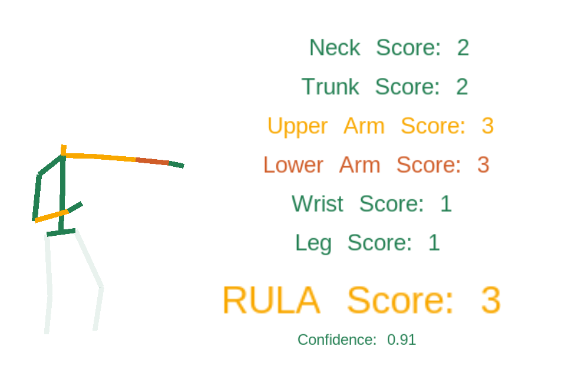

# ergonomic_assessment

# Installation
Clone this ROS package into your catkin_ws/src folder.
The package uses the topic \/body\_tracking\_data from the [Microsoft Azure Kinect ROS driver](https://github.com/microsoft/Azure_Kinect_ROS_Driver/blob/melodic/docs/usage.md#topics). 

# Launch ROS
Start ROS via ``roslaunch ergonomic_assessment rula.launch``

# Use Rosbags
To use recorded rosbags, run ``rosbag play '/path/rosbag.bag' --loop``

